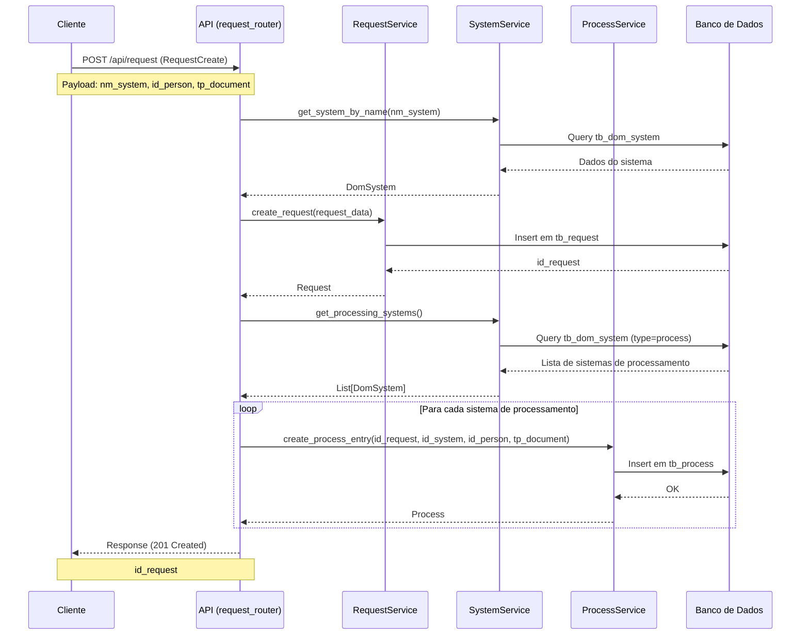
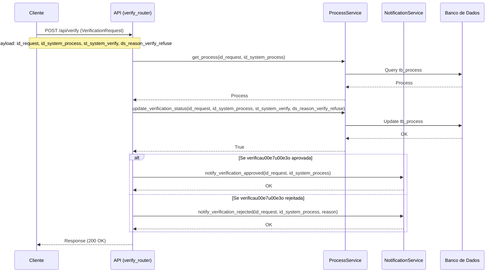
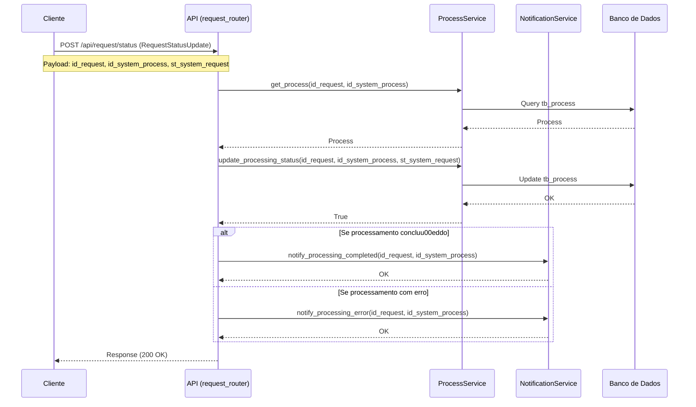
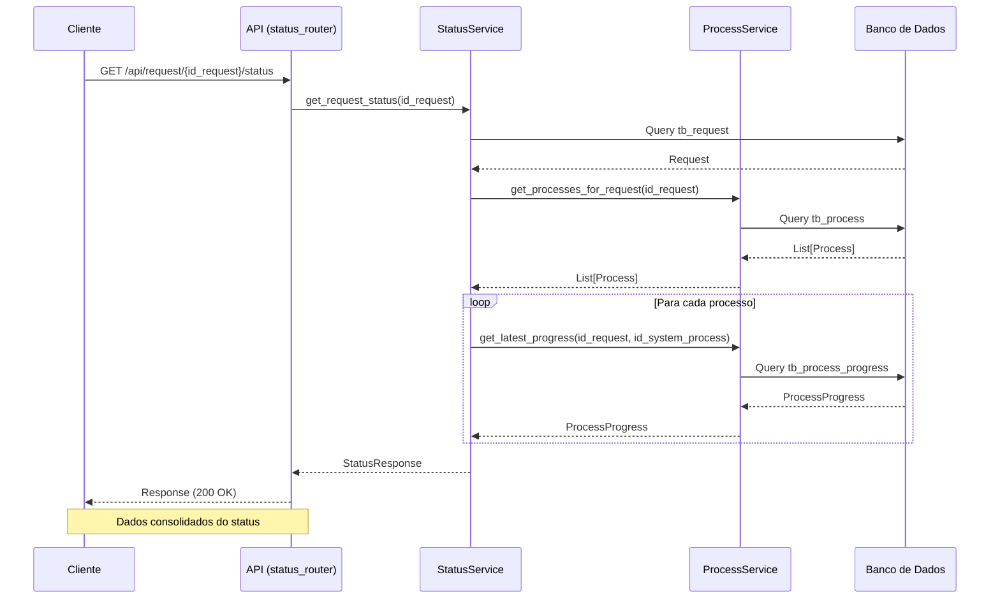

# Diagramas de Sequu00eancia do Request Manager

Este documento apresenta os diagramas de sequu00eancia que ilustram o funcionamento das principais APIs do sistema Request Manager. Os diagramas mostram as interau00e7u00f5es entre os clientes, endpoints da API, serviu00e7os, e o banco de dados.

## u00cdndice

1. [Criau00e7u00e3o de Requisiu00e7u00e3o](#1-criau00e7u00e3o-de-requisiu00e7u00e3o)
2. [Verificau00e7u00e3o de Identidade](#2-verificau00e7u00e3o-de-identidade)
3. [Atualizau00e7u00e3o de Status de Processamento](#3-atualizau00e7u00e3o-de-status-de-processamento)
4. [Consulta de Status](#4-consulta-de-status)

## 1. Criau00e7u00e3o de Requisiu00e7u00e3o

## 2. Verificau00e7u00e3o de Identidade

## 3. Atualizau00e7u00e3o de Status de Processamento

## 4. Consulta de Status

## Notas Adicionais

1. Os diagramas assumem que todas as validau00e7u00f5es necessu00e1rias su00e3o realizadas em cada etapa, e apenas os fluxos de sucesso su00e3o representados em detalhes.

2. Tratamento de erros:
   - Solicitau00e7u00f5es invu00e1lidas retornam cu00f3digo HTTP 400 (Bad Request)
   - Recursos nu00e3o encontrados retornam cu00f3digo HTTP 404 (Not Found)
   - Erros internos retornam cu00f3digo HTTP 500 (Internal Server Error)

3. Autenticau00e7u00e3o nu00e3o estu00e1 representada nos diagramas, mas assume-se que todas as requisiu00e7u00f5es su00e3o validadas pelo middleware de autenticau00e7u00e3o antes de alcanu00e7arem os endpoints.